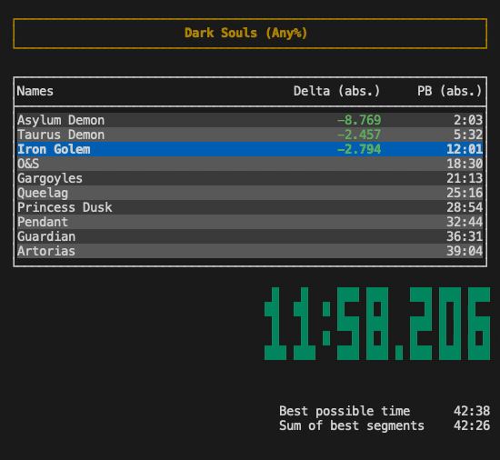

# Snail Split
Snail Split is a multi-platform, customizable, speedrun timer for the terminal.



## Overview
Snail Split is a speedrun timer built to run in the terminal.

If you, like me, are a huge fan of the terminal, this is exactly what the
doctor ordered. Otherwise, you are probably better off just using
[LiveSplit](https://livesplit.org/),
[Time Split Tracker](https://revenantkioku.itch.io/time-split-tracker-os-x),
or whatever other speedrun timer being widely used and extensively tested by
actual speedrunners.

Some, but not all, of Snail Split features are
* Multi-platform (Windows, macOS, Linux)
* Modular columns composition
* Autosave
* Theme customization

Snail Split has been built using [TypeScript](https://www.typescriptlang.org/),
with [React](https://reactjs.org/), [Blessed](https://github.com/chjj/blessed)
and, well, [React Blessed](https://github.com/Yomguithereal/react-blessed).


## Install
You can download Snail Split for different platforms at the following links
* [Windows](https://github.com/zuccha/snail-split/releases/download/v1.0.0/snail-split-1.0.0-win.exe)
* [macOS](https://github.com/zuccha/snail-split/releases/download/v1.0.0/snail-split-1.0.0-macos)
* [Linux](https://github.com/zuccha/snail-split/releases/download/v1.0.0/snail-split-1.0.0-linux)

Once you downloaded the executable, you can run it from the command line
```
./snail-split-1.0.0-macos savefile.json
```

Alternatively, you can clone this repo and run it from there
```
git clone https://github.com/zuccha/snail-split.git
cd snail-split
yarn install
yarn start savefile.json
```

This second method requires [Yarn](https://classic.yarnpkg.com/en/) and
[Node](https://nodejs.org/en/) 14.


## Run

Basic usage requires to run the program passing the save filename as argument.
For instance,
```
./snail-split ./games/dark-souls.json
```

This is the name of the file that stores data about the speedrun (current
times, best times, golds, _etc._). For more info about save files, see the
[save file](#save-file) section.

The program also accepts the following optional parameters:

### Config
The user can specify a custom configuration file via `c` or `config` flags
```
./snail-split ./games/dark-souls.json -c ./configs/minimal.json
./snail-split ./games/dark-souls.json --config=./configs/minimal.json
```

For more info about configuration files, see the [config](#config) section.

### Theme
The user can specify a custom theme file via `t` or `theme` flags
```
./snail-split ./games/dark-souls.json -t ./themes/dark.json
./snail-split ./games/dark-souls.json --theme=./themes/dark.json
```

For more info about theme files, see the [theme](#theme) section.

### Help
The help command prints the list of available options for the applications. If provided, any other flag will be ignored.
```
./snail-split -h
./snail-split --help
```

### Version
The version command prints the version of the application. If provided, any
other flag (other than help) will be ignored.
```
./snail-split -v
./snail-split --version
```


## Usage

The application supports the following commands:
| Command                   | Keybinding | Description                                                                                                            |
|---------------------------|------------|------------------------------------------------------------------------------------------------------------------------|
| startTimer                | none       | Start the timer.                                                                                                       |
| stopTimer                 | none       | Stop the timer.                                                                                                        |
| toggleTimer               | space      | Start the timer if stopped, and vice-versa.                                                                            |
| resetTimer                | r          | Clear all current times and stop timer.                                                                                |
| splitCurrentSegment       | return     | Set time for current segment, go to next and update best times if run has ended. Can be done only if timer is running. |
| invalidatePreviousSegment | backspace  | Clear time for previous segment.                                                                                       |
| scrollSegmentsUp          | up         | Move segments window up.                                                                                               |
| scrollSegmentsDown        | down       | Move segments window down.                                                                                             |
| save                      | s          | Save current timer state.                                                                                              |
| quit                      | q          | Close program if in timer view, or goes back to timer view if in help view.                                            |
| forceQuit                 | C-c        | Close program (even if in help view).                                                                                  |
| help                      | h          | Stop timer and open help view, or close help view if already open                                                      |
|                           |            |                                                                                                                        |

Keybindings can be customized, for more information read the
[config](#configuration) section.


## Save file
The save file contains all information about a speedrun. The savefile is in
JSON format and has the following structure
```typescript
{
  // Title of the game.
  "title": string,
  // Category of the speedrun (e.g., "any%).
  "category": string,
  // List of segments. Every segment has the following structure:
  "segments": [{
    // Name of the segment.
    "name": string,
    // Time in milliseconds, from the start of the run to the end of this
    // segment, in the current run (optional).
    "currentAbsoluteTime": number,
    // Time in milliseconds, from the start of the run to the end of this
    // segment, in your personal best run (optional).
    "pbAbsoluteTime": number,
    // Time in milliseconds, from the start of the run to the end of this
    // segment, in the world record run (optional).
    "wrAbsoluteTime": number,
    // Best (smallest) time in milliseconds, from the end of the previous
    // segment to the end of this one, ever recorded (optional).
    "goldRelativeTime": number,
  }],
  // Current status of the run. You should not touch this.
  "status": "initial" | "pending" | "done"
}
```

Whenever you split, the `currentAbsoluteTime` for the undergoing segment is
updated. If the split time is the best ever recorded, the `goldRelativeTime`
for the segment is updated.

Whenever a run ends (split on last segment), if `currentAbsoluteTime` for the
last segment is smaller than its `pbAbsoluteTime`, all `pbAbsoluteTime` are
substituted with `currentAbsoluteTime` (_i.e_, the current run becomes the PB).

Except for the `status` field, you can edit this file to set your times
manually.

**N.B.: Do not edit the save file while the application is running.**

You can find examples of save files in the `examples/games/` directory in
this repository.


## Configuration

The configuration allows the user to control specific aspects of the program.
A user can specify a custom configuration via a configuration file, provided
with the `c` or `config` options (see [run](#run)).

The configuration file is a JSON file with the following structure
```typescript
{
  // Number of updates to the timer per second (default: 30).
  "fps": number,

  // Turn on/off autosave (default: true).
  "autosave": boolean,
  // Time interval, in milliseconds, for autosave (default: 10000).
  "autosaveInterval": number,
  // Turn on/off show message confirming autosave success (default: false).
  "autosaveShowMessage": boolean,

  // Type of font for total time (default: "slim").
  "timeFont": "slim" | "fat",
  // Time formats for total time (for more, see time formats section).
  "timeFormatDefault": string,     // (default: "H:MM:SS.mmm").
  "timeFormatBelowHour": string,   // (default: "M:SS.mmm").
  "timeFormatBelowMinute": string, // (default: "S.mmm").
  "timeFormatBelowSecond": string, // (default: "0.mmm").
  "timeFormatZero": string,        // (default: "0.000").
  "timeFormatEmpty": string,       // (default: "0.000").

  // Descriptions for columns you want to appear in the application.
  // For more info about column definitions, check the section below.
  "segmentColumnDefinitions": [ColumnDefinition],

  // Time formats for time columns (for more, see time formats section).
  // Time columns are columns that show the time (e.g., current, PB) for every
  // segment.
  "segmentTimeFormatDefault": string     // (default: "H:MM:SS.mmm").
  "segmentTimeFormatBelowHour": string   // (default: "M:SS.mmm").
  "segmentTimeFormatBelowMinute": string // (default: "S.mmm").
  "segmentTimeFormatBelowSecond": string // (default: "0.mmm").
  "segmentTimeFormatZero": string        // (default: "0.000").
  "segmentTimeFormatEmpty": string       // (default: "-").

  // Time formats for delta time columns (for more, see time formats section).
  // Delta time columns are columns that show the delta time between two
  // different times (e.g., current - PB) for every segment.
  "segmentDeltaFormatDefault": string     // (default: "H:MM:SS.mmm").
  "segmentDeltaFormatBelowHour": string   // (default: "M:SS.mmm").
  "segmentDeltaFormatBelowMinute": string // (default: "S.mmm").
  "segmentDeltaFormatBelowSecond": string // (default: "0.mmm").
  "segmentDeltaFormatZero": string        // (default: "0.000").
  "segmentDeltaFormatEmpty": string       // (default: "-").

  // Show/hide best possible time (default: true).
  // Best possible time is the best possible time you can achieve during the
  // current run, considering the current time plus the sum of remaining
  // segments' best times.
  "showBestPossibleTime": boolean
  // Show/hide sum of best times (default: true).
  // Sum of best times is the sum of segments' best times (golds).
  "showSumOfBests": boolean

  // Duration in milliseconds for messages in the app (default: 3000).
  // Messages appear when manually saving, an error occurs, etc.
  "snackbarDuration": number

  // Custom keybindings. You can either set a single ASCII printable character
  // (e.g., "A", "b", "%", "~"), a lowercase letter prefixed by "C-" for
  // control (e.g., "C-a", "C-x") or one of the following special characters:
  //   "space", "backspace", "escape", "delete", "return", "linefeed", "tab",
  //   "up", "down", "left", "right", "pageup", "pagedown", "home", "end",
  //   "f1", "f2", "f3", "f4", "f5", "f6", "f7", "f8", "f9", "f10", "f11", "f12"
  // You can also set `null` if you want a command to have no binding at all.
  "keybindings": {
    "startTimer": string | null,                // (default: null)
	"stopTimer": string | null,                 // (default: null)
    "toggleTimer": string | null,               // (default: "space")
    "resetTimer": string | null,                // (default: "r")
    "splitCurrentSegment": string | null,       // (default: "return")
    "invalidatePreviousSegment": string | null, // (default: "backspace")
    "scrollSegmentsUp": string | null,          // (default: "up")
    "scrollSegmentsDown": string | null,        // (default: "down")
    "save": string | null,                      // (default: "s")
    "quit": string | null,                      // (default: "q")
    "forceQuit": string | null,                 // (default: "C-c")
    "help": string | null,                      // (default: "h")
  }
```

Any of the described options can be omitted, in which case the default value
will be used.

For more information about what keybinding commands do, see the
[usage](#usage) section.

Check the default configuration in `examples/configurations/default.json` and
other configurations in the same folder.

### Time formats
Time formats allow the user to customize the format of times displayed in the
application. A time format is a string that supports the following
characters: `H`, `M`, `S`, `m`, `:`, `.` and `-`, plus all digits.

When formatting a time, `H` will be converted to hours, `M` to minutes, `S`
to seconds and `m` to milliseconds.
You can put several consecutive letters, in which case the time will be
padded with zeros to have at least that many digits. For instance, `HH` will
produce `02` if the time has two hours, `13` if it has thirteen and `125` if
it has on-hundred twenty-five.

In the options, these different formats are used for different time ranges:
* `default`: For times that are one-hour or more.
* `belowHour`: For less than one hour, but more than one minute.
* `belowMinute`: For less than one minute, but more than one second.
* `belowSecond`: For less than one seconds, but more than zero.
* `zero`: For time equal to zero.
* `empty`: When time is not defined (_e.g._, invalid splits, future segments).

### Column definitions
Snail Split allows for modular columns composition. This means the user can
specify what columns he wants to see and what they should display. Columns
can show current, personal best or world record times, or the difference of
any pair of them. In addition to that, the user can display time in relative
or absolute terms (_i.e._, the duration of the split, or time elapsed since
the run started to the end of the segment).

To define a column featuring a time
```typescript
{
  // Tells the column to display a time.
  "type": "time",
  // Title of the column displayed in the header.
  "title": string,
  // Which type of time to display in the column. Either current,
  // personal best or world record run.
  "timeCategory": "current" | "pb" | "wr",
  // How the time should be displayed. By choosing "absolute", for every
  // segment it will display the time since the start of the run, to the end
  // of the segment. By choosing "relative", it will display the duration of
  // the segment (from end of previous segment to end of current).
  "timeFrame": "absolute" | "relative"
}
```

To define a column featuring the delta time between two different categories
```typescript
{
  // Tells the column to display the delta time between two categories.
  "type": "delta",
  // Title of the column displayed in the header.
  "title": string,
  // How to compute the delta. For each segment, the delta will be computed
  // by doing `leftTimeCategory - rightTimeCategory`.
  "leftTimeCategory": "current" | "pb" | "wr",
  "rightTimeCategory": "current" | "pb" | "wr",
  // How the time should be displayed. By choosing "absolute", for every
  // segment it will display the time since the start of the run, to the end
  // of the segment. By choosing "relative", it will display the duration of
  // the segment (from end of previous segment to end of current).
  "timeFrame": "absolute" | "relative"
}
```

The default column definitions have
* a column with `current - pb` delta time (time save/loss on segment compared
to best time).
* a column with segment time since the beginning of the run.
```typescript
{
  ...
  "columnDefinitions": [
    {
      "title": "Delta",
      "type": "delta",
      "leftTimeCategory": "current",
      "rightTimeCategory": "pb",
      "timeFrame": "absolute"
    },
    {
      "title": "PB",
      "type": "time",
      "timeCategory": "pb",
      "timeFrame": "absolute"
    }
  ]
}
```

## Theme
Through the theme, you can customize colors of the application. A user can
specify a custom theme via a theme file, provided with the `t` or `theme`
options (see [run](#run)).

Currently, the theme only allows colors customization. In general, `bg`
refers to background color and `fg` refers to text color.

The theme file is a JSON file with the following structure
```typescript
{
  // General colors for the application.
  "app": {
    "colorBg": color, // (default: "#1A202C")
    "colorFg": color  // (default: "#CBD5E0")
  },
  // Colors for header (title and category).
  "header": {
    "titleColorBg": color,  // (default: "#1A202C")
    "titleColorFg": color,  // (default: "#B7791F")
    "borderColorBg": color, // (default: "#1A202C")
    "borderColorFg": color  // (default: "#B7791F")
  },
  // Colors for the segments table.
  "segments": {
    // Border that surrounds table and separates header from other rows.
    "borderColorBg": color,           // (default: "#1A202C")
    "borderColorFg": color,           // (default: "#CBD5E0")
    // Header cells.
    "headerColorBg": color,            // (default: "#1A202C")
    "headerColorFg": color,            // (default: "#CBD5E0")
    // Even rows (not header).
    "itemEvenColorBg": color,          // (default: "#2D3748")
    "itemEvenColorFg": color,          // (default: "#CBD5E0")
    // Odd rows (not header).
    "itemOddColorBg": color,           // (default: "#4A5568")
    "itemOddColorFg": color,           // (default: "#CBD5E0")
    // Current segment.
    "itemCurrentColorBg": color,       // (default: "#2B6CB0")
    "itemCurrentColorFg": color,       // (default: "#CBD5E0")
    // Columns with delta times.
    "deltaTimeColorFgNegative": color, // (default: "#38A169")
    "deltaTimeColorFgNeutral": color,  // (default: "#CBD5E0")
    "deltaTimeColorFgPositive": color  // (default: "#C53030")
  },
  // Total time of the run.
  "time": {
    // Background color (default: "#1A202C").
    "colorBg": color,
    // When current time is worse (greater) than PB (default: "#E53E3E").
    "colorFgNegative": color,
    // When the current time equals the PB (default: "#CBD5E0").
    "colorFgNeutral": color,
    // When current time is better (smaller) than PB (default: "#2F855A").
    "colorFgPositive": color,
    // When the timer is paused // (default: "#A0AEC0").
    "colorFgPaused": color
  },
  // Message bar at the bottom of the application.
  "snackbar": {
    "neutralColorBg": color, // (default: "#1A202C")
    "neutralColorFg": color, // (default: "#CBD5E0")
    "successColorBg": color, // (default: "#1A202C")
    "successColorFg": color, // (default: "#38A169")
    "failureColorBg": color, // (default: "#1A202C")
    "failureColorFg": color, // (default: "#E53E3E")
    "warningColorBg": color, // (default: "#1A202C")
    "warningColorFg": color  // (default: "#DD6B20")
  }
}
```

You can check the default and other themes in `./examples/themes/` folder.

## Roadmap
Snail Split is still incomplete and lacks several features that make a
speedrun timer whole.

This is a non-exhaustive list of features that need to (and maybe will) be
implemented:
- [ ]  Add support for global keybindings
- [ ]  Add "undo" command (undo split, invalidate, _etc._)
- [ ]  Highlight golds
- [ ]  Add "previous segment save/loss" info
- [ ]  Add "possible save on this segment" info
- [ ]  Add possibility to hide segments table header
- [ ]  Add possibility to control the number of rows in the table header
- [ ]  Add confirmation dialogs on "save" and "quit"
- [ ]  Add number of attempts
